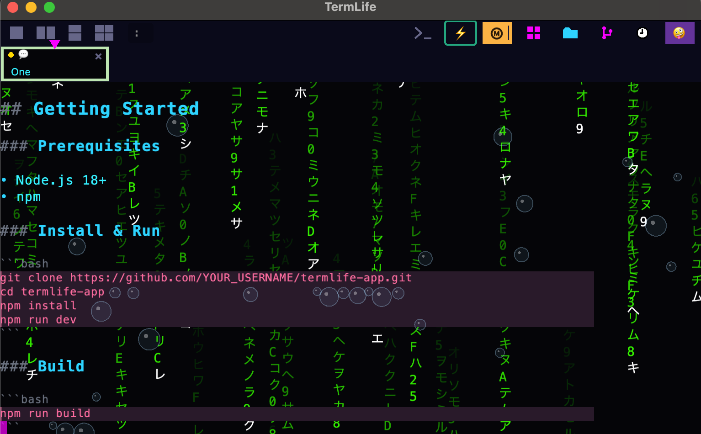

# TermLife

A terminal emulator for the vibe coding era. Actually it is built for a renaissance of "multi-tasking" brought to us in form of vibe coding. The category of the terminal app is one of the first that ever existed and yet has never been really re-thought from the ground up. Here is a stab at it: If you are in a terminal session, but another session (tab) needs your attention (LLM is calling for help!) with a key-combo or click on can switch to the next highest-priority session. Except that feature is still a bit buggy. What works well though is the Markdown rendering. With English being the hottest new coding language and AI-assisted coders mostly editing markdown files this is a nice feature to have. Check out below screenshot based on command "vi README.md": it shows the screen of the anient `vi` editor - it does not know that the terminal program detects markdown, rescales fonts and detects other formatting do-dads. Having surplus compute a 'raising bubble' effect has been added via a click and the hidden 'matrix rain' animation to complete the orchestration - all geared to keep you in the "flow" so you can keep vibe-coding!



**Please note that this is a hobby project in an early stage. One cannot with confidence say this terminal app is ready for sensitive projects because it has not been thoroughly tested and contains AI-generated code!** 

That said: it would be all the more helpful if you try it out and leave some feedback or maybe even contribute!

## Features

- **Semi-Markdown mode:** Font-aware markdown rendering with bold, italic, headers, and more in the terminal
- **Smart tab switching:** Ctrl+Tab jumps to the tab that needs your attention most
- **AI chat navigation:** Jump back and forth in AI chat conversations using key combos (ctrl-shift arrow-up/down)
- **Split panes:** Single, vertical, horizontal, and quad layouts. Inspired by `tmux` but with copy/paste working
- **Git support:** yep,  another git client built in
- **Views:** dashboard, command history, version control, file browser: different views available using key-combo or button
- **Graphics effects:** Physics-based particle effects like raising bubbles, snow-fall. Reason: no reason, just fun for the flow and all
- **Productivity tools:** built-in optional clock and pomodoro timer

## Getting Started

### Prerequisites

- Node.js 18+
- npm

### Install & Run

```bash
git clone https://github.com/beoinformatics/termlife-app.git
cd termlife-app
npm install
npm run dev
```

### Build

```bash
npm run build
```

## Keyboard Shortcuts

| Shortcut              | Action                    |
| --------------------- | ------------------------- |
| `Cmd/Ctrl+T`        | New tab                   |
| `Cmd/Ctrl+W`        | Close tab                 |
| `Cmd/Ctrl+1-9`      | Switch to tab N           |
| `Ctrl+Tab`          | Smart tab switch          |
| `Ctrl+Shift+K`      | Toggle Semi-Markdown mode |
| `Ctrl+Shift+C`      | Toggle CRT filter         |
| `Ctrl+Shift+M`      | Toggle Matrix rain        |
| `Shift+PageUp/Down` | Scroll up/down            |
| `Cmd/Ctrl+C`        | Copy selection            |
| `Cmd/Ctrl+V`        | Paste                     |

## Architecture

TermLife uses [@xterm/headless](https://github.com/xtermjs/xterm.js) as the ANSI state machine and [PixiJS v8](https://pixijs.com/) for all rendering. PTY processes are managed via [node-pty](https://github.com/niconicomern/node-pty) in Electron's main process.

```
PTY (node-pty) → IPC → @xterm/headless → CellGrid → PixiJS GPU rendering
```

## Contributing

Contributions are welcome! See [CONTRIBUTING.md](CONTRIBUTING.md) for how to get started.

## License

[MIT](LICENSE) — Copyright (c) 2026 Eckart Bindewald and contributors
